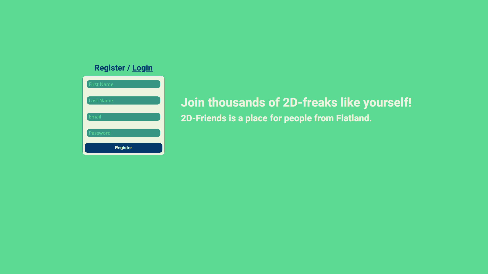
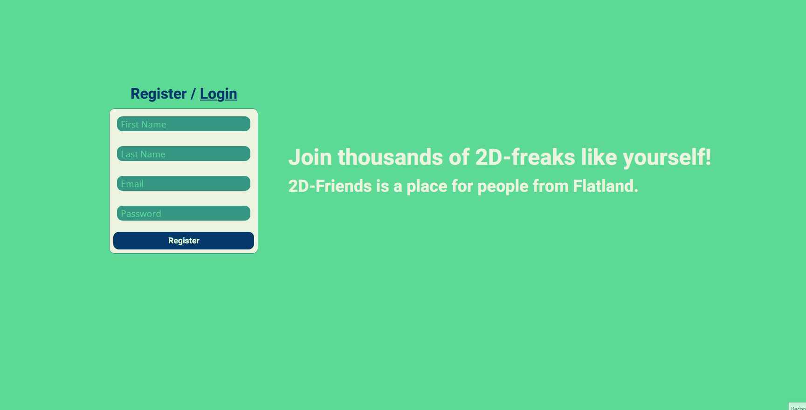
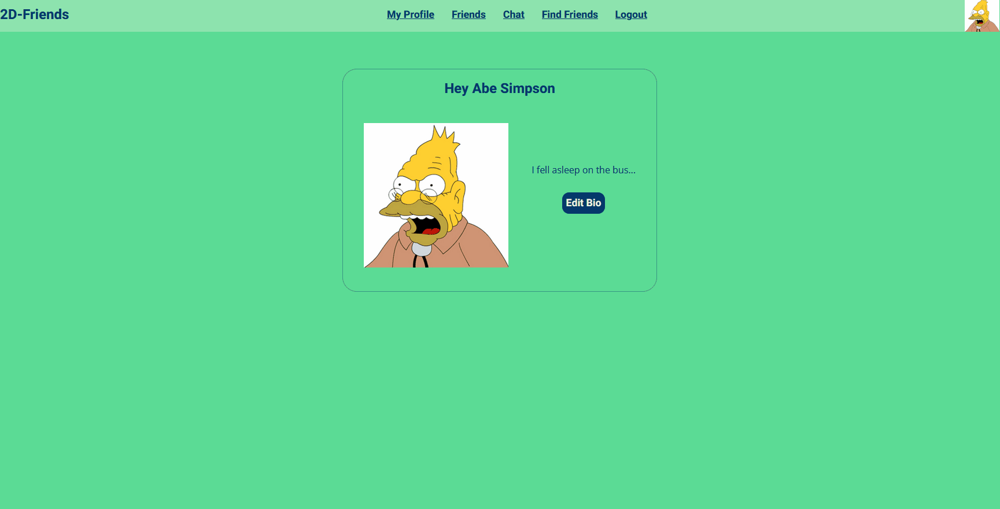
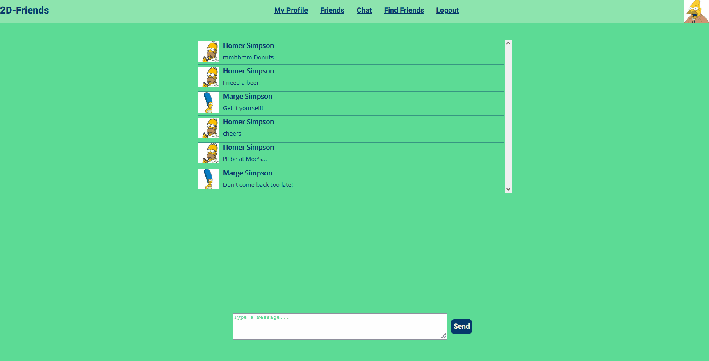

# spiced-socialnetwork
This was a project for the SPICED Academy Full Stack Bootcamp. A social network built with React, Redux and socket.io. 

[Demo hosted on Heroku](https://twodfriends.herokuapp.com/#/)

## Registration

## Login, change Avatar

## Add / find friends

## Chat

